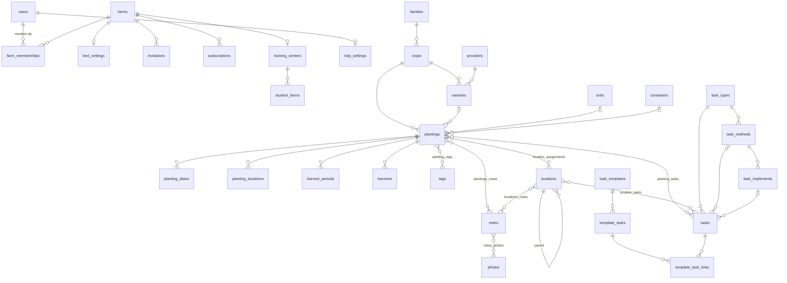

# Sillon — Modèle de données

*Extrait des migrations Brinjel (schéma `public` : 24 migrations, schéma ferme : 30 migrations, état au 15/09/2026). Source : https://framagit.org/brinjel/brinjel, © André Hoarau, AGPL-3.0-or-later.*

> **Note de portage (16/09/2026) — ce document est dépassé sur plusieurs points.**
>
> Il a été rédigé sans accès au code Elixir, et laissait huit points « à confirmer ».
> Le code de Brinjel a depuis été lu. Six de ces huit points étaient faux et ont été
> corrigés dans Sillon ; la migration `20260916090000_align_sur_brinjel` convertit les
> données. Ce document reste utile pour la structure des tables, mais **sur les unités,
> les énumérations, les formules de semences et le modèle des dates, la référence est
> désormais le code** : `packages/core/src/units.ts`, `types.ts`, `seeds.ts` et
> `planting.ts`, dont les commentaires citent le fichier Elixir d'origine. Le tableau
> « Portage depuis Brinjel : ce qui a été vérifié » du `README.md` récapitule les écarts.

---

## 1. Décision d'architecture : multi-tenant

Brinjel utilise **un schéma PostgreSQL par ferme** (`farm_<id>`) plus un schéma `public` pour les comptes. Toutes les requêtes métier passent un `prefix`.

**Recommandation pour Sillon : un seul schéma, colonne `farm_id` sur chaque table métier, isolation par Row-Level Security.**

Pourquoi :
- Prisma et Drizzle gèrent mal le schéma dynamique par tenant ; les migrations deviennent une boucle sur N schémas (c'est ce que fait Brinjel avec `farm_schema_migrations`, qu'il faut rejouer à chaque ferme).
- RLS PostgreSQL (`SET app.farm_id`) donne une isolation équivalente sans multiplier les objets.
- Les fermes modèles / fermes d'apprenants (centres de formation) deviennent une simple copie de lignes filtrées par `farm_id`.

Coût : ajouter `farm_id` dans les index uniques (ex. `(farm_id, name)` sur `families`).

---

## 2. Diagramme entité-relation

---

## 3. Schéma global (comptes, fermes, abonnements)

| Table | Rôle | Points notables |
|---|---|---|
| `users` | Compte utilisateur | `email` citext unique, `hashed_password`, `confirmed_at`, `last_seen`, `locale` (défaut `fr`), `profile` JSON |
| `users_tokens` | Jetons session / confirmation / reset | `context` + `token` uniques, `sent_to` |
| `totp_settings` | 2FA | 1 ligne par user, `secret` binaire, `enabled`, `last_used_at` |
| `totp_recovery_codes` | Codes de secours | hachés |
| `farms` | Ferme (tenant) | `name`, `slug` unique, `country_code` (`FR`), `locked`, `trial_expiry_date`, `default_provider_id`, `task_overdue_window_value` + `_unit` (défaut 1 an) |
| `farm_memberships` | Rôle d'un user sur une ferme | PK `(farm_id, user_id)`, `role` string ; index partiel : **un seul `owner` par ferme** |
| `invitations` | Invitation par email | unique `(farm_id, email)`, `invitation_id` public unique, `inviter_id` |
| `bed_settings` | Réglages planches | 1 ligne par ferme : `bed_width`, `path_width`, `bed_length`, `standardized_beds` (entiers, unité BedLength) |
| `subscriptions` | Abonnement Paddle | montants en centimes, `status`, `next_billed_at`, `canceled_at`, `paused_at`, changement planifié |
| `billing_details` | IDs client Paddle | 1 ligne par ferme |
| `training_centers` | Centre de formation | = une ferme ; `default_template_farm_id`, durées de formation (défaut 365 j) |
| `student_farms` | Ferme d'apprenant | rattachée à un centre, créée depuis `template_farm_id` |
| `oban_jobs`, `error_tracker_*` | Infra | remplacés par BullMQ + Sentry |

Extensions PostgreSQL requises : `citext`, `unaccent`, `ltree`.

---

## 4. Schéma ferme (données de culture)

### 4.1 Référentiel

| Table | Champs | Unicité |
|---|---|---|
| `families` | `name`, `color`, `interval` (délai de rotation, en années ou mois — à confirmer) | `name` |
| `crops` (espèces) | `name`, `color`, `family_id`, `default_variety_id` | `(name, family_id)` |
| `varieties` | `name`, `crop_id`, `provider_id` (obligatoire) | `(name, crop_id, provider_id)` |
| `providers` (fournisseurs) | `name`, `type` (entier : semences / plants ?) | `(name, type)` |
| `units` | `name` (kg, botte, pièce…) | `name` |
| `containers` (plaques/caisses de pépinière) | `name`, `size` (nb d'alvéoles) | `name` |
| `tags` | `name`, `color` | `name` |
| `task_types` | `name`, `color` | `name` |
| `task_methods` | `name`, `type_id` | `(name, type_id)` |
| `task_implements` (outils) | `name`, `method_id` | `(name, method_id)` |

Hiérarchie des tâches : **type → méthode → outil** (ex. Désherbage → Manuel → Houe maraîchère).

### 4.2 Séries (`plantings`) — table centrale

| Champ | Type | Sens |
|---|---|---|
| `crop_id` | FK obligatoire | espèce |
| `variety_id` | FK nullable | variété |
| `planting_type` | entier | mode : semis direct / plant produit en pépinière / plant acheté (valeurs à confirmer dans `lib/brinjel/`) |
| `in_greenhouse` | bool | sous abri |
| `length` | bigint | longueur de planche (unité BedLength) |
| `rows` | int | nb de rangs |
| `spacing_plants` | bigint | espacement sur le rang |
| `yield_per_bed_meter` | bigint | rendement escompté par mètre |
| `price_per_unit` | bigint | prix, en centimes |
| `unit_id` | FK | unité de vente/récolte |
| `container_id` | FK | plaque de semis |
| `seeds_per_gram`, `seeds_per_hole_seedling`, `seeds_per_hole_direct`, `seeds_extra_percentage`, `estimated_greenhouse_loss` | int | paramètres du **calcul de semences** |
| `finished`, `finish_reason` | bool, int | série clôturée (raison : à confirmer) |

Tables satellites, toutes en `(planting_id, type)` :

- `planting_dates` : `type` (entier : semis pépinière / semis-plantation / début récolte / fin récolte…), `planned`, `effective`. **Chaque date a un prévu et un réalisé.**
- `planting_durations` : `type`, `duration` (jours) — durée pépinière, durée avant récolte, durée de récolte.
- `harvest_periods` : `begin`, `end` — plusieurs fenêtres de récolte possibles.

### 4.3 Parcellaire (`locations`)

Arbre à profondeur libre (jardin → serre → planche…) via `parent_id` + colonne `path` de type **ltree**, maintenue par trigger (`lpad(position, 5, '0')` à chaque niveau).

Champs : `name`, `bed_length` (obligatoire), `bed_width`, `greenhouse`, `position` (ordre parmi les frères).

`location_assignments` (planting × location, `length`) : **une série peut être répartie sur plusieurs planches**, avec la longueur occupée sur chacune. C'est la table de l'assolement ; l'historique de rotation en découle par jointure avec `planting_dates`.

### 4.4 Tâches

`tasks` : `planned_date`, `effective_date`, `done`, `days_in_field`, `planned_labor_time` / `effective_labor_time` (minutes ?), `description`, `default_type` (entier : semis / plantation / autre — permet de distinguer les tâches générées), `type_id`, `method_id`, `implement_id`.

Une tâche est liée à N séries (`planting_tasks`) et/ou N emplacements (`location_tasks`).

### 4.5 Itinéraires techniques

- `task_templates` : nom.
- `template_tasks` : une étape — `type_id`, `method_id`, `implement_id`, `days_in_field`, `planned_labor_time`, `description`, **`link_days` + `template_date_type`** (décalage en jours par rapport à une date de la série : semis, plantation, récolte…).
- `template_task_links` : trace, pour chaque tâche générée, l'étape d'origine et le décalage ; permet de **recaler les tâches quand les dates de la série changent**.

### 4.6 Suivi

- `harvests` : `date`, `quantity` (entier, dans l'unité de la série), `labor_time`, `done`.
- `notes` : `content`, `date`, `pinned`, `archived_at` ; liées à N séries et/ou N emplacements.
- `photos` : `name`, `uuid` (clé du fichier sur le stockage objet) ; N par note.

---

## 5. Conventions à reproduire

- **Toutes les mesures sont des entiers** : longueurs (type `BedLength`, probablement cm), prix en centimes, durées en jours, temps de travail en minutes. Pas de flottant en base — à respecter pour éviter les erreurs d'arrondi.
- `timestamps()` = `inserted_at` / `updated_at` partout.
- Suppression en cascade depuis la série ; `nilify` sur les référentiels optionnels (variété, unité, plaque, méthode, outil).
- Recherche insensible aux accents (`unaccent`) et à la casse.

---

## 6. Points à vérifier dans `lib/brinjel/` avant de coder

1. Valeurs des enums entiers : `planting_type`, `finish_reason`, `planting_dates.type`, `planting_durations.type`, `providers.type`, `tasks.default_type`, `template_date_type`.
2. Unité réelle de `BedLength` (cm ou mm) et de `labor_time`.
3. Sens de `families.interval` (rotation).
4. Formules : quantité de semences, nombre de plaques, rendement, disponibilité d'une planche.
5. Rôles possibles dans `farm_memberships.role` au-delà de `owner`.

Fichiers utiles : `lib/brinjel/planting.ex`, `lib/brinjel/plantings.ex`, `lib/brinjel/tasks.ex`, `lib/brinjel/locations.ex`, `lib/brinjel/bed_length.ex`, `lib/brinjel/admin/farm_membership.ex`.
